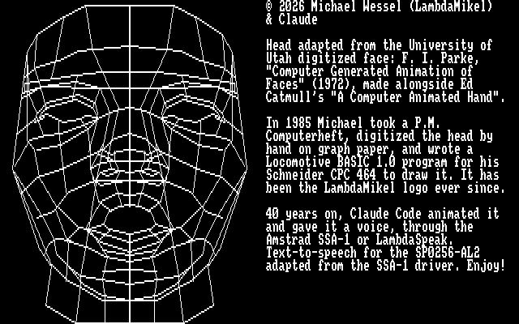
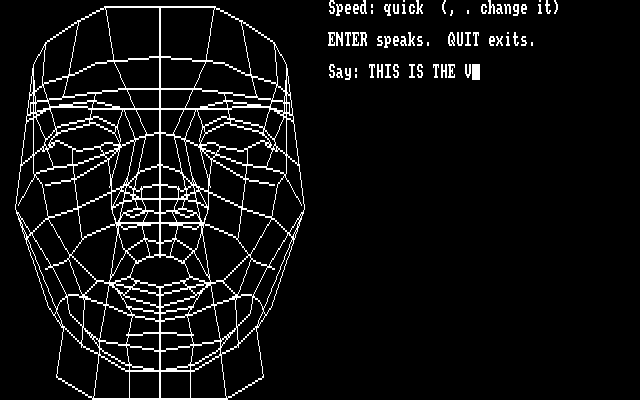
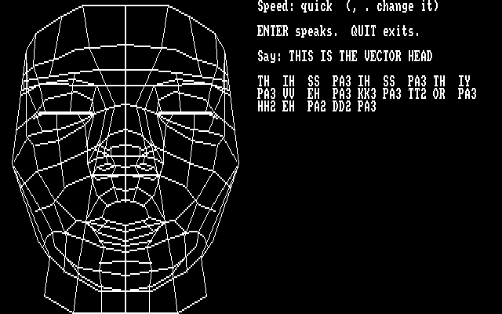
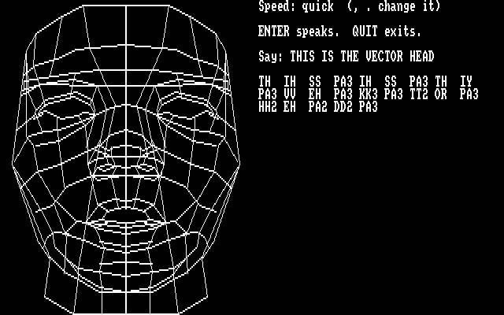
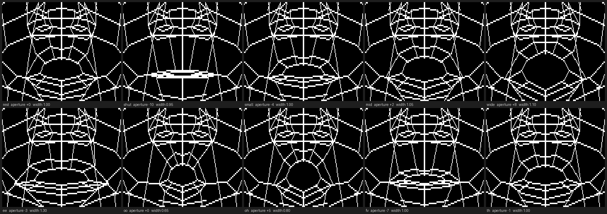

# animated-speaking-cpc-vector-head

**A Realtime-Animated Speaking Vector Head for the Amstrad CPC — Requires Amstrad SSA-1 or LambdaSpeak.**

A 1985 hand-digitized wireframe head, redrawn in Z80 assembler, animated in real time,
and given a voice: type any sentence and the head speaks it through the SP0256-AL2,
with the lips, the jaw, the chin and the eyes moving on the allophones.

📺 **Video:** https://youtu.be/UzU3wziq7BQ



---

## Contents

- [What it does](#what-it-does)
- [Screenshots](#screenshots)
- [Running it](#running-it)
- [The origin story](#the-origin-story)
- [How it works](#how-it-works)
- [Measurements](#measurements)
- [Building it](#building-it)
- [The toolchain](#the-toolchain)
- [Repository layout](#repository-layout)
- [Credits and provenance](#credits-and-provenance)

---

## What it does

Boot the disc, `RUN"VH`, and the head is drawn in **0.18 seconds** (the 1985 BASIC took
13.2). It introduces itself out loud — *"Hello. I am a vectorized computer head. I live in
the CPC. Just type what you want me to say."* — while the credits sit in a text window on
the right. Press a key and you get a prompt.

Whatever you type is run through the **Naval Research Laboratory letter-to-sound rules**,
turned into SP0256-AL2 allophones, spoken, and lip-synced: each allophone selects one of
ten mouth shapes, the mouth is redrawn between allophones, and the head blinks two or
three times over a long utterance. The allophones the rules produced are listed under the
prompt so you can see what it decided to say.

- `,` and `.` on their own change the speech rate (slow / medium / quick).
- `QUIT` on its own leaves.
- Empty line repeats the intro.

## Screenshots

| | |
|---|---|
|  |  |
| The credits, there to be read while it talks | The prompt, with the speed setting above it |
|  |  |
| What the 1985 rules made of the typed sentence | Mid-utterance: lips rounded on an `OR`, mid-blink, mesh intact |

The ten mouth shapes, rendered from the generator exactly as the Z80 draws them:



## Running it

**On real hardware.** You need a CPC with a disc drive and an **Amstrad SSA-1** speech
synthesiser, or **LambdaSpeak** in SSA-1 mode. Put `disk/head.dsk` on a disc, or
`disk/head.hfe` on a Gotek/HxC, then:

```
RUN"VH
```

`VH.BAS` reserves memory, loads the letter-to-sound engine low, and starts `HEAD.BIN`.
Starting `HEAD.BIN` directly is detected and refused — it checks for the engine's
signature first, because without it the head would draw and then speak nothing.

The memory map fits inside 64K and nothing switches banks, so a 464 or 664 with a disc
drive should work as well; development and all measurements here were done on an emulated
**6128**, and that is the only configuration actually tested.

**In an emulator.** MAME:

```
mame cpc6128 -flop1 disk/head.dsk -autoboot_delay 3 -autoboot_command 'RUN"VH\n'
```

MAME's `cpc6128` emulates the SSA-1 at `&FBEE`, so the speech works there too.

## The origin story

In 1985 or 1986, *P.M. Computerheft* — a German popular-science computer magazine — ran an
article on computer graphics that showed the University of Utah's famous digitized face.
Michael Wessel took the printed picture, laid tracing paper and graph paper over it, and
read off the vertices **by hand**. The coordinates went into a Locomotive BASIC 1.0 program
on his Schneider CPC 464, `P-C-S.BAS` — *Polygon Cracking Service* — which drew the head
one `DATA` polyline at a time, mirroring the digitized half to make the other. It has been
the LambdaMikel logo ever since, and it later appeared in *The Wrath of the CPC*.

The face itself goes back to **Frederick I. Parke**, *"Computer Generated Animation of
Faces"* (University of Utah, 1972) — the digitized head made in the same lab and the same
years as Ed Catmull's *"A Computer Animated Hand"*. It is the ancestor of every talking
wireframe face in computer graphics, which makes it a fitting thing to finally make talk on
an 8-bit micro.

Forty years on, this repository is the Z80 port: the same hand-read coordinates, the same
head, now drawn seventy times faster, animated, and speaking.

The original BASIC is preserved in [`original/`](original/) — `P-C-S.bas.txt` as text,
`MWSOFT2.DSK` as the disc it came off, and `WRATH.BAS`, which carries the same `DATA`.

## How it works

### From BASIC `DATA` to Z80 tables

[`src/mkhead.py`](src/mkhead.py) is the generator. It parses the `DATA` lines of
`P-C-S.BAS` (lines 190–650), reproduces the BASIC's coordinate transform — `ORIGIN 320,0`,
x scaled by 3, y by 2.9 — and emits [`src/headdata.inc`](src/headdata.inc), which the
assembler includes.

Two facts make the tables small. Only the digitized **half** is stored, because the other
half is the same polylines with x negated: dx from the centre fits in a byte (0..144) and
the scanline fits in a byte, so every segment has 8-bit deltas and the line routine never
needs a 16-bit counter. And the head is placed at x=159 rather than the BASIC's 320, so the
mirror `x -> 319-x` is a whole-byte column flip (`c -> 39-c`) — the right half of the screen
is then free for the text window.

The logical-to-physical y mapping is `(399 - y*2.9) / 2`. The 399 is measured against the
firmware's own line drawing, not a typo for 400.

The head is **44 chains, 2917 pixels per half**.

### Drawing

[`src/line.asm`](src/line.asm) is a MODE 2 Bresenham writing screen bytes directly —
`addr = base + (y AND 7)*2048 + (y/8)*80 + x/8`, one bit per pixel. The eight scanlines of
a character cell are exactly 2048 apart, so stepping down a scanline inside a cell is
`add a,8` on H; crossing into the next character row is one `add hl,#C050`. There are four
inner loops (x-major and y-major, each up and down) so no loop tests direction per pixel.

`base` is not a constant: it is `(drawbase)`, which is how double buffering works.

### Keeping the mesh intact

The first animation attempt moved the mouth polylines and left the face **torn open**: every
line of the surrounding mesh that *ends* on a mouth vertex stayed where it was.

The generator now solves this structurally. Each polyline of the original head is walked
segment by segment. A segment between two moving vertices is animated whole. A segment with
one moving end is **split**: an anchor is placed a fixed distance back along it (12 units
for the mouth, 8 for the eye), the far part is emitted as static geometry drawn once, and
the near part becomes an animated segment pivoting about that anchor. Segments touching
nothing that moves are collected into static chains.

The result is that the mouth can open and the mesh deforms with it, continuously, with no
seams — while the redraw still only touches the small box the mouth lives in.

### The mouth model

Opening and closing are **not** the same movement, and both are constrained by the face
they live in:

- **Closing** squashes the lips towards the line they meet on (`MID`, the line the two
  mouth corners sit on). The outer contour barely moves; the inner edges come together.
- **Opening** rotates a jaw: the lower lip and the chin creases below it travel down, the
  upper lip rises a *little*, and both are capped — `RISEMAX 3.5`, `DROPMAX 5.0` — so the
  upper lip can never climb into the nostrils. An earlier version did exactly that.
- The jaw field fades with height and with distance from the centre, and the lip corners
  are pinned, so nothing crosses anything else.

The generator **rasterizes** each shape with the same Bresenham the Z80 uses and asserts
that no lip pixel collides with the nose or the chin, reporting the clearance for every
shape (`clearance to the nose 4..23 scanlines`). A shape that would break the face fails the
build.

Ten shapes cover the AL2 set: `rest shut small mid wide ee oo oh fv th` — **19 chains, 676
pixels at most**, inside a box of **768 bytes**.

Three eye shapes (`open half shut`, 16 chains, 455-byte box) do the blinking.

*(An aside worth recording: the first working animation moved polylines 11, 12 and 13 —
which in a wireframe look every bit as much like a mouth as the real one does. They are the
**nostrils**. The head spoke out of its nose for an afternoon. The mouth is polylines 15,
16, 26, 27 and 28.)*

### Double buffering

XOR redraw was the obvious approach and it was wrong: measured against a Python rasterizer
that mirrors the Z80 Bresenham exactly, **33 to 61 pixels per viseme** ended up in the wrong
state, because shared pixels get toggled twice. The face accumulated dust and vertices came
apart.

So the program uses two full screen pages — `#C000` and `#4000` — flipped with
`SCR_SET_BASE (&BC08)`. A mouth change:

1. restores the clean box (saved once, with the head drawn and nothing else in it) into the
   page **not** on show,
2. ORs the new shape into it, plus its mirror,
3. flips the pages.

Drawing is OR, never XOR, so nothing can cancel anything. Per-page state (`pstate`) records
what each page currently shows, because the two pages are one frame apart — forgetting that
was what made the eyes blink at random during speech.

### Speech

The SP0256-AL2 sits at `&FBEE`. Status bit 7 is SBY (idle), bit 6 is LRQ (0 = ready for
another allophone). The obvious loop waits for SBY and leaves an audible gap after every
single allophone; feeding on **LRQ** instead pipelines the chip and takes the intro from
15.5 s to 11.9 s — 23% faster with no change in what is said.

The mouth is updated *inside* that wait loop, so the animation costs the speech nothing.

### Text-to-speech: the 1985 rules, as a subroutine

Turning arbitrary typed text into allophones is the NRL letter-to-sound algorithm, and a
version of it shipped in 1985 in the **Amstrad SSA-1 driver** (as the `|SAY` RSX). Rather
than reimplement it, this program uses it.

That is harder than it sounds, because the driver is not a library:

- it is **self-relocating** (an `RST 6` trick; its base ends up at load address + `&0AE0`),
- it has a **hard-wired** phoneme buffer at `&9600` — an absolute address, not a relative
  one, which quietly overwrote this program's eye buffer,
- it installs an **interrupt ticker that does not preserve IX**, which made the head draw in
  pieces,
- and it wants to own the machine.

The solution was to extract the engine. [`tools/reloc.asm`](tools/reloc.asm) plus
[`emu/grab_blob.lua`](emu/grab_blob.lua) let the driver relocate itself **once** inside the
emulator, for a load address of `&0200`, and capture the resulting 6016-byte image as
[`disk/NRL.BIN`](disk/NRL.BIN) (with a hand-built AMSDOS header — a headerless binary
`LOAD`ed from BASIC is read as BASIC text and gives *Syntax error*). The interrupt-ticker
flag at driver offset `&0844` is cleared in the image, so nothing starts.

At run time the program checks the signature, copies the image to `&0200`, and writes a
`JP sayhook` over the routine at `NRLBASE+&00D8` that used to hand an allophone to the
chip's queue. Converting a sentence is then an ordinary subroutine call:

```
CONVERT equ NRLBASE + #02BA     ; HL = text, B = length
```

…and the allophones arrive in `phonbuf` instead of the chip, to be spoken afterwards with
the mouth on them. No init, no RSX, no ticker — only the rules.

[`tools/dz80.py`](tools/dz80.py) (a Z80 disassembler) and [`tools/walk.py`](tools/walk.py)
(a code walker) are what the entry points were found with.

A small exception table fixes what the 1972 rules get wrong for this program's purposes —
`HEAD` reads as `HED`, and `LIVE` as the verb (`LIV`), because the rules read it as the
adjective and the head kept announcing that it *lifed* in the CPC.

### Lip sync

`VMAP` in the generator maps all 64 AL2 allophones to the ten visemes — `MM PP BB` to
`shut`, `IY YY` to `ee`, `UW WW SH` to `oo`, `FF VV` to `fv`, and so on. `durtab` carries
each allophone's duration so the mouth holds a shape for as long as the sound lasts.

Speed control respreads the inter-word pauses rather than changing the allophones: measured
at the `&FBEE` port, one test phrase takes **3.0 s** quick, **3.4 s** medium, **5.3 s** slow.

### Memory map

| Region | What |
|---|---|
| `#0200`–`#19BF` | the relocated 1985 letter-to-sound engine (6016 bytes) |
| `#3800`–`#3FFF` | clean-box buffers for the mouth (768 B) and eye (455 B) |
| `#4000`–`#7FFF` | screen page 1 |
| `#8000`–`#A5FF` | the program, its tables and buffers (`assert tabend < #A600`) |
| `#A700`+ | AMSDOS workspace — the reason for that assert |
| `#C000`–`#FFFF` | screen page 0 |

Code and data must live at `#4000` or above on a CPC, because the lower ROM shadows RAM at
`#0000`–`#3FFF` whenever the firmware pages it in. The exception, verified by measurement
here, is that plain RAM reads and writes *from our own code* at `#0200`–`#3FFF` are fine —
which is what makes the low engine and the low box buffers possible. (0 of 15,872 bytes
lost in the test.)

## Measurements

Everything below was measured in the emulator, not estimated:

| | |
|---|---|
| Head drawn, BASIC 1.0 | 13.18 s |
| Head drawn, Z80 | **0.180 s** (54 ticks of 1/300 s) — 73× |
| Head geometry | 44 chains, 2917 pixels per half, mirrored |
| Mouth redraw | ≤ 676 pixels per half, 768-byte box restore |
| Mouth changes sustained while speaking | 5.3 per second, speech never waiting |
| Intro utterance, SBY-waiting | 15.5 s |
| Intro utterance, LRQ-pipelined | **11.9 s** (−23%) |
| XOR redraw error, per viseme | 33–61 pixels wrong — why it uses double buffering |
| Test phrase at quick / medium / slow | 3.0 s / 3.4 s / 5.3 s |

## Building it

```
cd src
./build.sh        # generator, assembler, DSK
./dist.sh         # the above, plus the HFE for a Gotek/HxC
```

`build.sh` runs `mkhead.py` (regenerating `headdata.inc`), assembles with rasm, and builds
`head.dsk` with `HEAD.BIN`, `NRL.BIN` and `VH.BAS`. It greps rasm's output for
`Write binary file`, because **rasm reports a failed assembly on stdout and still exits 0**.

`preview.py` renders the viseme sheet without going near the emulator.

## The toolchain

| Tool | Used for |
|---|---|
| [rasm](https://github.com/EdouardBERGE/rasm) 3.2.7 | Z80 assembler (`assert`, `include`, `defs`) |
| [iDSK](https://github.com/cpcsdk/idsk) | building the `.dsk`, AMSDOS headers |
| [hxcfe](https://hxc2001.com/) (HxC Floppy Emulator) | `.dsk` → `.hfe` for Gotek/HxC |
| [MAME](https://www.mamedev.org/) 0.264, driver `cpc6128` | emulation, and every measurement here |
| MAME Lua scripts | screen dumps, I/O taps, timing, automated key posting |
| Python 3 + Pillow | the table generator, the rasterizer used for assertions, previews |
| `xvfb-run` | MAME headless, off the desktop |

Two traps worth writing down, both of which cost hours:

- **MAME Lua reads below `#4000` return the lower ROM, not RAM.** To inspect low memory you
  have to make the CPC copy it somewhere above `#4000` first.
- **MAME's key posting mangles or drops the first character of each post.** The scripts here
  post a throwaway `{ENTER}` first and retry until the program signals that it started.

## Repository layout

```
src/        head.asm      the program
            line.asm      the MODE 2 Bresenham
            headdata.inc  generated tables (head, visemes, eyes, allophone maps)
            mkhead.py     the generator: BASIC DATA -> Z80 tables, with assertions
            preview.py    renders the viseme sheet
            build.sh      generator + rasm + iDSK
            dist.sh       the above + hxcfe
            VH.BAS        the loader
            allophones.txt  the SP0256-AL2 allophone set

disk/       head.dsk      ready to run
            head.hfe      the same, for a Gotek or HxC
            HEAD.BIN      the assembled program (AMSDOS header, loads at #8000)
            NRL.BIN       the extracted letter-to-sound engine (relocated for #0200)

original/   P-C-S.bas.txt the 1985 Locomotive BASIC program, as text
            MWSOFT2.DSK   the disc it came off
            WRATH.BAS     The Wrath of the CPC, which carries the same head DATA

tools/      dz80.py       Z80 disassembler, used on the SSA-1 driver
            walk.py       code walker, used to find the driver's entry points
            reloc.asm     lets the driver relocate itself so the image can be captured
            SSA1.BIN      the 1985 Amstrad SSA-1 driver, as the engine was taken from

emu/        lay6.lua      dumps a screen page and decodes the layout
            nltrace.lua   traces every cursor move the program makes
            spdtap.lua    taps &FBEE to time allophones
            film2.lua     captures a run frame by frame
            grab_blob.lua captures the relocated driver image
            shots.lua     the screenshots in docs/
            meter.lua     the timings in the table above
```

## Credits and provenance

- The head: **F. I. Parke**, *"Computer Generated Animation of Faces"*, University of Utah,
  1972 — digitized by hand off a *P.M. Computerheft* article by **Michael Wessel** in 1985.
- The 1985 BASIC, the digitization, and *The Wrath of the CPC*: **Michael Wessel
  (LambdaMikel)**.
- The Z80 port, the animation, the speech integration and this README: **Claude Code**
  (Claude Opus 5), 2026, working with Michael.
- **LambdaSpeak**: https://github.com/lambdamikel/LambdaSpeak

⚠️ **Third-party code.** `tools/SSA1.BIN` and the `disk/NRL.BIN` derived from it are the
1985 **Amstrad SSA-1 speech driver** — third-party code, included here for provenance and
because the program runs its letter-to-sound rules directly. This repository is **private**.
Before making it public, settle the licensing of those two files (or ship only the
extraction recipe in `tools/reloc.asm`, which reproduces `NRL.BIN` from a driver the user
supplies).

© 2026 Michael Wessel (LambdaMikel) & Claude.
